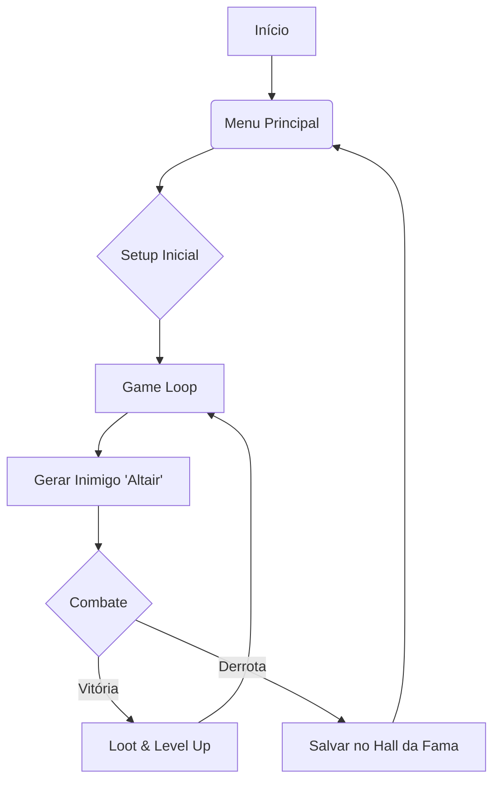

# ⚔️ Altair o Renascido: Roguelike Auto Battler


> *"A morte não é o fim, apenas uma chance para redistribuir seus atributos."*

**Altair o Renascido** é um RPG de texto *Roguelike* focado em combate tático. O jogador cria um gladiador e enfrenta encarnações infinitas de "Altair". O objetivo é sobreviver o maior número de rounds possível para gravar seu nome no Hall da Fama.

---

## 🤖 O Que o Gemini 3.0 Fez?

Este projeto foi desenvolvido em *pair programming* com a IA **Gemini 3.0**.

*   **🎨 Art Direction:** Criação de todas as artes ASCII (Mago, Ladino, Guerreiro, Morte e Vitória) e Redesign de todos os menus/quase todos os outputs.
*   **📺 Render Engine:** Desenvolvimento da função `renderizar_cena` para montar o HUD lado a lado com a arte, eu não sabia fazer isto, apanhei muito.
*   **🧠 Refatoração Lógica:** Otimização de ponteiros na geração de itens para limpar o código, estava uma bagunça infindável.
*   **🛡️ Estabilidade:** Implementação de buffers seguros na leitura de arquivos de save, eu me perdi muito aqui.
*   **⚖️ Balanceamento:** Ajuste matemático na fórmula de esquiva (Cap de 60%) e dano, entre outros, o jogo estava quebrado/desbalanceado/impossível.

---

## 📜 Manual de Regras e Mecânicas

O jogo funciona em um loop infinito. Não existe "fim", apenas a derrota.

### 1. Classes e Estilos de Jogo

*   **🛡️ Guerreiro (HP Base: 15)**
    *   *Foco:* Defesa Alta.
    *   *Estilo:* Tanque. Aguenta muito dano, ideal para iniciantes.

*   **🔮 Mago (HP Base: 12)**
    *   *Foco:* Força Alta.
    *   *Estilo:* "Glass Cannon". Bate muito forte, mas morre rápido se for tocado.

*   **🗡️ Ladino (HP Base: 9)**
    *   *Foco:* Esquiva Alta.
    *   *Estilo:* Risco total. Pouquíssima vida, mas evita a maioria dos golpes.

### 2. Atributos e Matemática
O combate é resolvido automaticamente. Entenda os números:

*   **FOR (Força):** Aumenta seu dano base.
    *   *Fórmula:* `(FOR + 1d6) - Defesa Inimigo`.
*   **DEF (Defesa):** Reduz diretamente o dano recebido.
*   **AGI (Esquiva):** Chance de ignorar totalmente o dano.
    *   *Fórmula:* `AGI * 5%` (Máximo limitado a 60%).
*   **HP (Vida):** Se chegar a 0, é Game Over.

### 3. Progressão e Loot (Vitória)
Ao derrotar Altair, você recupera a vida e ganha **+1 em todos os Limites (Caps)** e **+3 Pontos** para distribuir. Além disso, deve escolher um prêmio:

1.  **Limite Break:** Aumenta em +2 o limite máximo de um atributo. *Escolha quando estiver maximizado.*
2.  **Item Artefato:** Equipa uma nova Arma, Armadura ou Acessório. *Escolha para poder imediato.*
3.  **Vingança:** Causa 5 de dano grátis no próximo round. *Escolha se o próximo desafio for difícil.*

### 4. O Inimigo (Altair)
*   **Renascimento:** A cada round, Altair muda de classe aleatoriamente.
*   **Evolução:** Ele ganha os mesmos pontos que você. No modo difícil, ele ganha bônus por round.

---

## 🧩 Fluxo do Jogo


# 🛠️ Stack Tecnológico

Linguagem: C (C99)

Bibliotecas: Standard IO, Stdlib, Time.h

Sistema: Windows (windows.h) & Linux (unistd.h)

# 🚀 Como Jogar

Linux / macOS:
```code
Bash
gcc main.c -o altair_game
./altair_game
```
Windows:
```code
Cmd
gcc main.c -o altair_game.exe
altair_game.exe
```
<div align="center">
<sub>Desenvolvido por Ector Falcão e Lógica Neural Artificial.</sub>
</div>
