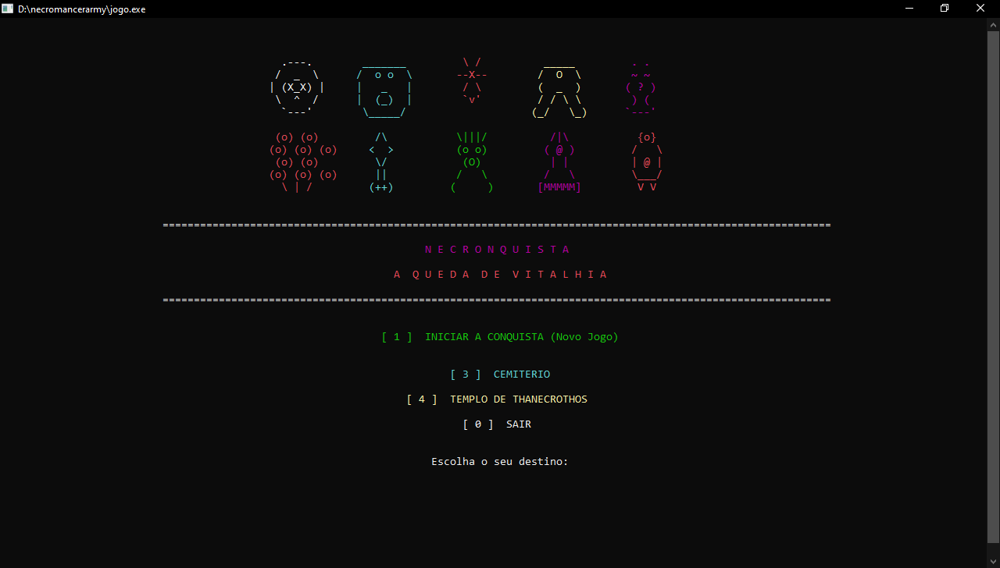
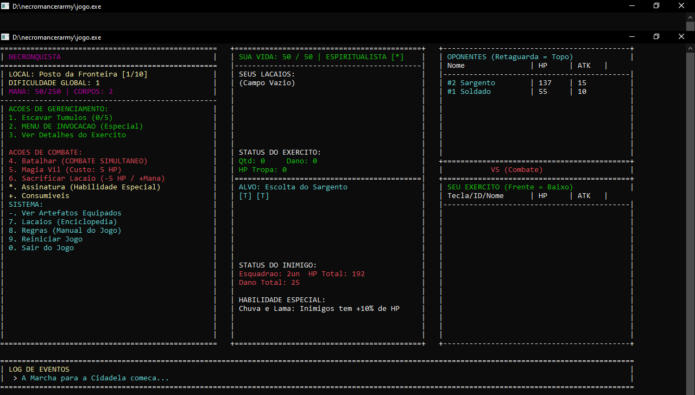
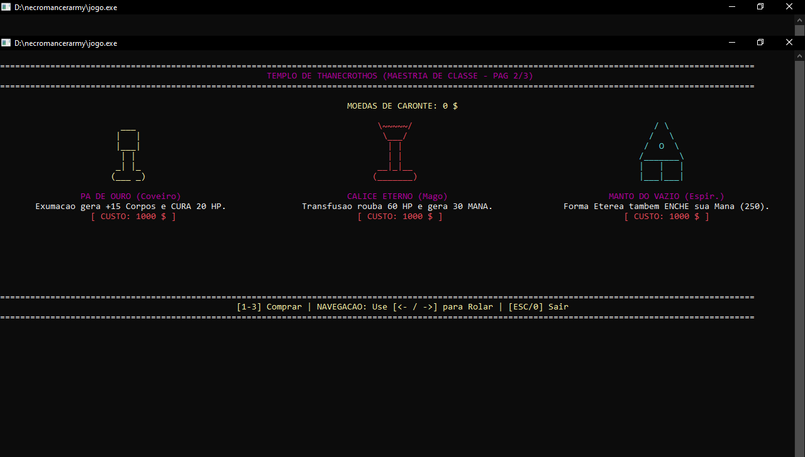
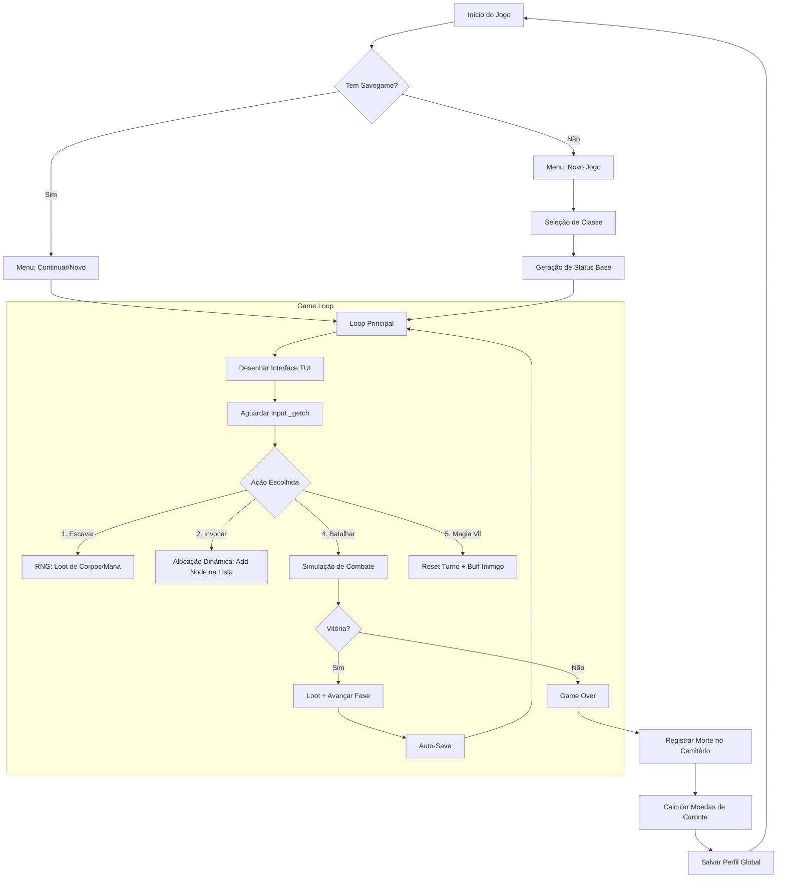

# 💀 Necronquista: A Queda de Vitalhia


> *"A morte não é o fim, é apenas um recurso a ser gerenciado."*

---

## 📜 Sobre o Projeto

**Necronquista** é um jogo de estratégia e simulação de batalha desenvolvido inteiramente em linguagem C, rodando diretamente no console (TUI - Text User Interface). O projeto nasceu como parte do meu portfólio acadêmico para demonstrar o domínio sobre **Estruturas de Dados**, **Lógica de Programação**, **Persistência de Dados** e **Engenharia de Software**.

O jogo coloca você na pele de um Necromante marchando contra o reino de Vitalhia. Diferente de RPGs tradicionais onde você é o herói, aqui você é o vilão gerenciando um exército de mortos-vivos.

### 🎮 Gênero
*   **Auto-Battler / Strategy RPG:** O combate é resolvido automaticamente baseado na composição do seu exército.
*   **Roguelite:** Morte permanente, mas com progressão global (Loja e Cemitério) que facilita as próximas tentativas.
*   **Resource Management:** Equilíbrio constante entre Mana, Corpos e sua própria Vida (HP).

---

## 📸 Galeria (Screenshots)

### 🖥️ Menu Inicial

*Interface de boas-vindas com arte ASCII customizada e menu de navegação.*

### ⚔️ Interface de Jogo (HUD)

*Layout de 3 colunas: Menu de Ações (Esq), Status Visual (Dir) e Lista Tática (Baixo/Dir).*

### 🏛️ Templo de Thanecrothos (Loja)

*Sistema de progressão persistente onde moedas obtidas em runs anteriores compram vantagens permanentes.*

---

## 🛠️ Stack Tecnológico & Aprendizados

Este projeto foi o culminar de todo o aprendizado do 1º Semestre de Análise e Desenvolvimento de Sistemas, expandido com estudos autodidatas.

### 🧠 Hard Skills Aplicadas (Faculdade)
*   **Estruturas de Dados Dinâmicas:** Uso intensivo de **Listas Encadeadas** (`struct Minion* proximo`) para gerenciar o exército do jogador, permitindo inserção e remoção de unidades (`malloc`/`free`) em tempo real sem limite fixo de tamanho.
*   **Persistência de Dados (File I/O):**
    *   `savegame.dat`: Gravação binária (`fwrite`/`fread`) do estado completo do jogo (structs aninhadas) para continuar de onde parou.
    *   `perfil.dat`: Sistema de "Meta-Progression" que salva moedas e desbloqueios entre sessões.
    *   `cemiterio.dat`: Log histórico de todas as mortes (Hall of Fame reverso).
*   **Algoritmos de Ordenação e Busca:** Lógica para filtrar alvos prioritários no combate (ex: Sifão buscando o lacaio com menor HP).
*   **Ponteiros e Alocação de Memória:** Manipulação direta de memória para evitar vazamentos (Memory Leaks) ao destruir unidades.

### 🚀 Novas Competências (Aprendizado Autônomo + IA)
*   **Interface de Console Avançada (Windows API):**
    *   Uso de `windows.h` para controle total do terminal (tamanho da janela, cores ANSI, esconder cursor).
    *   Técnicas de **Anti-Flicker** (redesenho otimizado) para evitar que a tela pisque durante atualizações rápidas.
*   **Áudio (WinMM):** Integração com `winmm.lib` para tocar trilha sonora em loop (`mciSendString`).
*   **Design de Interface (UX/UI em Texto):** Criação de layouts responsivos baseados em caracteres, alinhamento centralizado matemático e uso de cores para hierarquia visual.

### 🤖 O Papel da IA (Gemini 1.5 Pro)
A Inteligência Artificial atuou como um "Senior Pair Programmer" neste projeto:
*   **Geração de Assets:** Todas as artes ASCII complexas e os textos de lore foram co-criados ou refinados pela IA.
*   **Matemática de Layout:** O Gemini auxiliou no cálculo de padding para centralizar textos em uma tela de 160 colunas.
*   **Refatoração:** Sugestões para modularizar o código gigante (ex: separar a lógica de desenho da lógica de jogo).

---

## ⚙️ Funcionamento do Código (Arquitetura)

O jogo opera em um **Game Loop** infinito controlado por estados. Abaixo, um diagrama simplificado do fluxo de dados:



---

# Destaque: Sistema de Combate

O combate utiliza uma lógica de fila/pilha modificada. O inimigo ataca a "frente" do seu exército (o último lacaio invocado - LIFO visual). Se o lacaio morre (free), o dano excedente passa para o próximo nó da lista (m->proximo). Se a lista estiver vazia, o dano atinge diretamente o HP do jogador.

# 💻 Destaque de Código: Lógica de Combate & Ponteiros

Um dos maiores desafios técnicos deste projeto foi implementar o sistema de combate utilizando Listas Encadeadas (Linked Lists). Diferente de um array fixo, o exército do jogador é dinâmico, crescendo e diminuindo na memória RAM conforme lacaios são invocados ou destruídos.
O trecho abaixo demonstra a lógica de "Escudo de Carne": quando o inimigo ataca, o dano percorre a lista de lacaios. Se o primeiro da fila morre, o ponteiro head é atualizado, a memória é liberada com free(), e o dano restante "vaza" para o próximo nó da lista.


```C
// Lógica de distribuição de dano na Lista Encadeada
int danoRestante = ataqueInimigo;

// Enquanto houver dano E houver lacaios na lista
while (danoRestante > 0 && player->exercito_head != NULL) {
    
    // O lacaio na "frente" da batalha (Head da Lista)
    Minion* vitima = player->exercito_head;
    
    // CASO 1: O dano é letal
    if (vitima->hp <= danoRestante) {
        danoRestante -= vitima->hp; // O dano restante é reduzido pela vida do lacaio
        
        // Remove o nó da lista e libera a memória RAM
        matarMinion(player, vitima, NULL); 
    } 
    // CASO 2: O lacaio sobrevive (Tanque)
    else {
        vitima->hp -= danoRestante;
        danoRestante = 0; // O ataque parou aqui
    }
}

// Se o exército foi aniquilado e ainda sobrou dano...
if (player->exercito_head == NULL && danoRestante > 0) {
    // ...o Necromante toma dano direto na vida
    player->hp -= danoRestante;
}
```

🧠 Conceitos Aplicados neste Trecho:
Manipulação de Ponteiros: O código navega pela estrutura player->exercito_head e atualiza as referências de memória em tempo real.
Gerenciamento de Memória (free): A função matarMinion (chamada no código) utiliza free(vitima) para evitar vazamento de memória (memory leak) quando uma unidade é destruída.
Lógica de Fila/Pilha: O sistema funciona como uma Pilha (LIFO) visual para o combate, onde o último invocado é o primeiro a defender.

---

# 📦 Como Compilar e Rodar

Requisitos: Windows (devido às bibliotecas windows.h e conio.h).

Compilador: GCC (MinGW) ou Visual Studio.

Arquivo de Áudio: Coloque um arquivo chamado tema.mp3 na mesma pasta do executável (anexado tema de Necromancer Tower como sugestão).

Comando GCC:

```code

gcc main.c -o necronquista.exe -lwinmm
```

---

# 🎓 Conclusão Acadêmica

Este projeto demonstra que conceitos abstratos de sala de aula — como listas encadeadas e manipulação de arquivos — são as ferramentas fundamentais para construir softwares complexos e divertidos. A transição de "exercícios de lógica" para um "produto completo" exigiu não apenas código, mas planejamento, design e criatividade.

---

<div align="center">
<sub>“Desenvolvido por Ector Falcão em pair programming com Gemini 1.5</sub>
</div>
