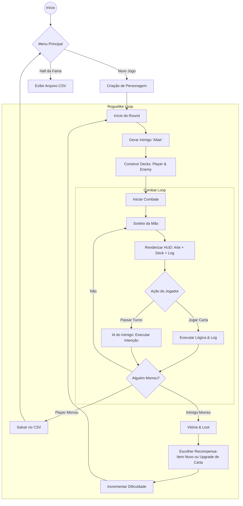

# ⚔️ Altair, o Renascido: Roguelike RPG

Este repositório documenta a evolução de um jogo de RPG em C, demonstrando a transição de um sistema de batalha automatizado baseado em estatísticas para um **RPG Tático de Construção de Baralho (Deck-builder)** complexo.

O projeto está dividido em duas fases principais:
1.  **Auto Battler** (Versão Legada/Conceito Inicial)
2.  **Roguelike RPG** (Versão Final - Código na raiz deste repositório)

---

## 🤖 O Pair Programming com Gemini 3.0

Uma parte crucial do desenvolvimento desta versão final foi a utilização de Inteligência Artificial (Gemini 3.0) em um fluxo de *Pair Programming Intensivo*.

A divisão de trabalho foi clara: **A lógica de jogo, regras de balanceamento e arquitetura do sistema foram definidas por mim**, enquanto a IA atuou como um especialista em **Frontend de Terminal e Otimização**.

### O Papel da IA no Projeto:
1.  **Motor de Renderização (HUD):** O Gemini foi responsável por criar a lógica complexa que renderiza o terminal em 3 colunas alinhadas (Arte, Deck e Log). Fazer o alinhamento de strings e buffers manualmente em C consumiria o tempo que foi dedicado ao gameplay.
2.  **Artes Visuais:** Todas as artes ASCII (classes e telas de morte) foram geradas pela IA.
3.  **Refatoração de Segurança:** A IA auxiliou na troca de funções inseguras e na gestão de buffers de string para evitar *overflows* na interface.
4.  **Adaptação Cross-Platform:** Implementação das diretivas de pré-processador para garantir que comandos como `Sleep` e `clear` funcionassem tanto em Windows quanto em Linux.

---

## 🧠 Aprendizados e Evolução Técnica

Este projeto representa a consolidação de todo o conhecimento adquirido no semestre, aplicando conceitos que vão muito além da lógica de programação básica. Para desenvolver o *Altair*, foi necessário dominar:

### 1. Manipulação Avançada de Console (Windows API)
Diferente dos projetos anteriores que usavam `system("cls")` (que causa uma "piscada" na tela), neste jogo aprendi a utilizar a biblioteca `<windows.h>` para manipular o **Buffer do Console** diretamente.
*   **Função `fast_clear()`:** Utiliza `GetStdHandle` e `SetConsoleCursorPosition` para desenhar o próximo frame por cima do anterior instantaneamente, criando uma renderização fluida sem *flickering*.
*   **Compilação Condicional (`#ifdef _WIN32`):** O código foi preparado para ser portável, detectando o sistema operacional e ajustando as funções de limpeza de tela e `sleep` automaticamente.

### 2. Arquitetura de Software (Game Loop)
Implementação do padrão de projeto **Game Loop**, essencial no desenvolvimento de jogos:
1.  **Input:** Captura e sanitização da entrada do usuário (tratando *buffer* sujo com `getchar`).
2.  **Update:** Processamento da lógica (Turnos, Mana, Dano, IA do Inimigo).
3.  **Render:** Atualização visual da interface ASCII e do Log de Combate.

### 3. Estruturas de Dados Complexas
Uso intensivo de **Structs Aninhadas** e **Enums**:
*   A `struct Gladiador` contém arrays da `struct Carta`.
*   Uso de `typedef enum` para controlar Classes (`MAGO`, `GUERREIRO`) e Tipos de Movimento, tornando o código legível e fácil de manter.

### 4. Manipulação de Strings e Buffers
O sistema de **Log de Combate** exigiu um controle preciso de memória:
*   **Algoritmo de Quebra de Linha:** Uma função recursiva (`log_add`) que detecta se a mensagem é maior que a largura da caixa (45 caracteres) e a divide automaticamente em múltiplas linhas no array global.
*   **Formatação Dinâmica:** Uso de `sprintf` para gerar descrições de cartas em tempo real (ex: transformar "Dano Base" em "12 Dano" dependendo do nível do upgrade).

### 5. Bibliotecas e Funções Novas
*   **`<locale.h>`:** Configuração de `setlocale` para permitir acentuação correta no terminal.
*   **`<time.h>`:** Uso de `srand(time(NULL))` para garantir que a geração procedural do deck inimigo e dos drops de itens seja sempre única a cada execução.

### 6. Inteligência Artificial (IA) Simples
Desenvolvimento de uma lógica para o inimigo ("Altair") que não joga aleatoriamente, mas constrói uma "Intenção" baseada na mana disponível, simulando um oponente estratégico.

---

## 🔄 Evolução do Projeto: De Auto-Battler para Tático

A diferença entre a versão inicial e a versão final é uma reescrita completa do *Core Loop* (ciclo central) do jogo. O foco mudou de simulação matemática passiva para tomada de decisão ativa.

### Principais Alterações Técnicas e de Design

| Característica | 📁 Versão Anterior (Auto Battler) | 🚀 Versão Final (Tactics) |
| :--- | :--- | :--- |
| **Gênero** | Auto-Battler / Gerenciamento de Stats | Roguelike Deck-Builder / Tático |
| **Combate** | Automático: `Dano = Força - Defesa` | Turnos Manuais: Sistema de Cartas, Mana e Mão |
| **Atributos** | Caps de Força, Defesa e Agilidade | Mana, Escudo Temporário, Intenção do Inimigo |
| **Progressão** | Distribuição de pontos de atributo | Loot de Itens que alteram o Deck e Upgrade de Cartas |
| **Interface (UI)** | Log de texto linear simples | **HUD Complexa:** 3 colunas (Arte, Deck, Log) renderizadas simultaneamente |
| **Complexidade** | Loops simples de subtração de HP | Gerenciamento de Arrays, Strings dinâmicas e Lógica de Baralho |

## 🎮 Mecânicas da Versão Final

*   **Sistema de Classes:** Mago, Ladino e Guerreiro, cada um com decks base e atributos de HP únicos.
*   **Combate por Cartas:**
    *   Gerenciamento de **Mana** (3 por turno).
    *   Tipos de cartas: Ataque, Defesa, Esquiva e Especial.
    *   Mecânica de "Intenção": Você pode ver o que o inimigo fará no próximo turno.
*   **Sistema de Itens:** Equipar uma Espada, por exemplo, remove as cartas de "Soco" e adiciona cartas de "Lacerar" e "Contra-Ataque" ao seu baralho.
*   **Roguelike Loop:** Morte permanente. A cada vitória, o inimigo "Altair" renasce mais forte e com uma nova classe.

---

## 📊 Estrutura do Código (Fluxo)

O diagrama abaixo ilustra o ciclo de vida do jogo, destacando a separação entre o *Loop Roguelike* (infinidade de rounds e progressão) e o *Loop de Combate* (turnos táticos com cartas).


---

## 💡 Destaque do Código: Sinergia entre Itens e Deck

O coração da mudança de "Auto-Battler" para "Tático" está nesta lógica. Em vez de itens fornecerem apenas estatísticas passivas, eles definem o arquétipo do jogador.

O trecho abaixo demonstra como o código traduz um equipamento (String) em mecânicas de jogo (Cartas), futuramente eu gostaria de implementar a possibilidade de que um Mago use uma Espada se desejar, criando builds híbridas dinamicamente, mas não sei se continuarei mexendo no projeto.

```c
// Função que traduz o inventário em cartas jogáveis
void adicionar_cartas_item(Gladiador *g, char *item, char *slot) {
    if (strcmp(item, "Nada") == 0) return;

    // Se o jogador equipou uma Espada, ele ganha cartas ofensivas e defensivas equilibradas
    if (strstr(item, "Espada")) { 
        g->deck[g->qtd_cartas++] = criar_carta("Lacerar", "7 Dano", item, TIPO_ATK, 2, 7);
        g->deck[g->qtd_cartas++] = criar_carta("Contra-Ataque", "5 Escudo", item, TIPO_DEF, 1, 5);
    }
    // Se equipou um Cajado, ganha dano massivo e controle de grupo (Stun)
    else if (strstr(item, "Cajado")) { 
        g->deck[g->qtd_cartas++] = criar_carta("Inferno", "12 Dano", item, TIPO_ATK, 3, 12);
        g->deck[g->qtd_cartas++] = criar_carta("Congelar", "6 Dano + Stun", item, TIPO_ATK, 2, 6);
    }
    // Lógica similar para armaduras e acessórios...
}
```

---

<div align="center">
<sub>“Desenvolvido por Ector Falcão.</sub>
</div>
