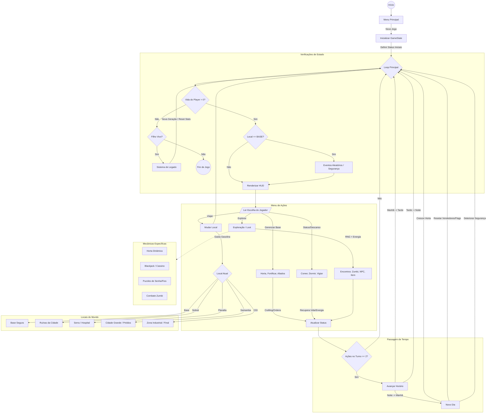

# 🧟 SOBREVIVA E PROTEJA (EM DESENVOLVIMENTO)

> **"O mundo acabou. O legado continua."**


---

## 📟 Transmissão Recebida...

**Sobreviva e Proteja** não é apenas um jogo em C; é um simulador de desespero e esperança renderizado no terminal. Você assume o papel de um pai/mãe em um apocalipse zumbi implacável. Sua missão não é apenas viver mais um dia, mas garantir que seu filho, **Leo**, tenha um futuro.

O jogo combina gerenciamento tático de recursos, exploração de mundo aberto (textual) e um sistema de legado único.

> *"Dizem que há um lugar seguro chamado Éden. Preciso seguir para Sobral. A resposta deve estar lá."*

---

## 🌟 Destaques do Sistema

| Funcionalidade | Descrição |
| :--- | :--- |
| **⏳ Ciclo Circadiano** | Manhã, Tarde e Noite afetam eventos e riscos. A noite é escura e cheia de terrores. |
| **🎒 Sobrevivência Hardcore** | Gerencie Fome, Energia, Gasolina, Munição e a integridade da Base, além da criança. |
| **🧬 Sistema de Legado** | **Permadeath com um twist.** Se você morrer, Leo assume o manto anos depois. O jogo continua em uma nova geração. |
| **🗺️ Mundo Aberto (ASCII)** | Viaje de carro entre cidades ruínas, serras nebulosas e zonas industriais perigosas. |
| **🎲 RNG & Estratégia** | Combate baseado em risco, eventos aleatórios e minigames de lógica e sorte. |

---

## 🛠️ Mecânicas Detalhadas

O coração do jogo bate através de sistemas interconectados. Entenda como não morrer:

### 🌱 A Horta (Sustentabilidade)
Não dependa apenas de saques. A terra é sua amiga.
*   **Ciclo Real:** `Semente` ➔ `Broto` ➔ `Maduro` 🍅
*   **Hidratação:** Plantas bebem água todo turno. Se secarem (0%), elas morrem.
*   **Adubo:** O "cheat code" da natureza. Acelera o crescimento drasticamente.

### 👦 O Garoto (Leo)
Leo é um NPC dinâmico. Ele aprende, ajuda e precisa de cuidados.
1.  **Nível 1 (Sombra):** 🥷 Aumenta a segurança passiva da base.
2.  **Nível 2 (Olheiro):** 🔭 Encontra itens extras durante explorações.
3.  **Nível 3 (Jardineiro):** 🌻 Rega plantas automaticamente em emergências.
4.  **Nível 4 (Socorrista):** 🚑 **Ultimate:** Pode reviver você usando um Kit Médico se sua vida zerar.

### 👥 Recrutamento (Os 20 Sobreviventes)
O mundo está cheio de almas perdidas. Traga-as para a base e dê ordens diárias:
*   **🛡️ Defensores:** (Ex: Marcos, Pedro) Mantêm os zumbis fora das muralhas.
*   **🧪 Especialistas:** (Ex: Lucia, Elisa) Sintetizam Gasolina e Adubo do nada.
*   **❤️ Suporte:** (Ex: Bianca, Neide) Curam feridas e enchem a barriga.
*   *Dica:* Aliados sem tarefas vigiam a base automaticamente (+Segurança).

### 🗺️ O Mapa Mundi
Use **Gasolina** ⛽ para mover seu veículo entre as zonas:
*   🏠 **Base:** Seu refúgio.
*   🏙️ **Sobral:** Ruínas urbanas. Ótimo para comida e remédios.
*   ⛰️ **Planalta:** A serra fria. Lar de eventos militares.
*   🏢 **Samamba:** A selva de pedra vertical. Alto risco, loot de elite.
*   🏭 **CEI:** O complexo industrial final. Requer explosivos para acessar.

---

## 🎮 Controles

A interface é **Numpad-Friendly**, projetada para jogabilidade rápida.

*   Use os **Números (0-9)** para selecionar opções nos menus.
*   Pressione **ENTER** para confirmar escolhas.
*   Pressione **ENTER** novamente para avançar os diálogos e "Momentos" narrativos.

> **⚠️ Aviso:** O jogo não salva automaticamente ao fechar a janela. Use o sistema de Hibernação (Dormir) ou chegue ao final para ver o desfecho.

---

## 🏗️ Estrutura do Código

Para os curiosos e devs, o jogo é uma "catedral monolítica" em C estruturado:

*   **`GameState` (A Mente):** Uma `struct` massiva passada por referência (`*gs`) que segura o universo inteiro (inventário, flags de história, status de 20 NPCs, variáveis de tempo).
*   **HUD Render (Os Olhos):** Um sistema de buffer de strings (`logs[5]`) cria um console rolante dentro de uma interface estática, desenhada frame a frame com `system("cls")`.
*   **Módulos de Local:** Cada cidade é uma função isolada (ex: `resolverCassino()`, `resolverMetro()`) contendo seus próprios loops e minigames.
*   **Flags de Persistência:** O jogo lembra o que você fez. Matou um NPC? Ele não volta. Abriu um cofre? Ele fica aberto.



---
## 🧠 Aprendizados e Competências Técnicas (C)

O desenvolvimento deste jogo de sobrevivência em texto (*Text-Adventure RPG*) exigiu a aplicação prática de conceitos avançados da linguagem C, indo muito além da sintaxe básica. Abaixo estão as principais competências desenvolvidas e aplicadas no projeto:

### 1. Arquitetura de Software e Gerenciamento de Estado
O maior desafio foi manter o estado do jogo persistente e consistente enquanto o jogador navegava por dezenas de menus, locais e situações diferentes.
*   **Structs Aninhadas e Complexas:** Criação da estrutura `GameState`, que atua como um objeto central ("God Object") contendo todas as variáveis vitais (vida, inventário, flags de história, status de NPCs, estruturas de horta).
*   **Manipulação de Ponteiros:** Aplicação de passagem por referência (`GameState *gs`) em praticamente todas as funções (`resolverExploracao`, `modificarStatus`, etc.). Isso permitiu a modularização do código, onde funções externas alteram o estado real do jogo na memória sem a necessidade de variáveis globais desorganizadas.

### 2. Manipulação Avançada de Strings e Buffers
Para criar uma interface imersiva com Logs de rolagem e um Diário formatado, foi necessário um controle rigoroso de memória e texto.
*   **Formatação de Buffers:** Uso extensivo de `sprintf` e `snprintf` para concatenar variáveis dinâmicas (nomes de NPCs, valores de dano) dentro de strings de interface antes de imprimi-las.
*   **Algoritmo de Word Wrapping:** Implementação manual de lógica para quebra de linha no sistema de Diário, garantindo que textos longos se ajustem visualmente à caixa de texto da HUD sem quebrar o layout.
*   **Filas (Log System):** Implementação de uma lógica de "fila" (FIFO) para o sistema de logs, onde novas mensagens empurram as antigas para fora do vetor de visualização.

### 3. Lógica Matemática e Probabilística (RNG)
O "coração" do jogo baseia-se em risco e recompensa, exigindo balanceamento numérico.
*   **Geração Procedural de Eventos:** Uso de `rand() % 100` para criar tabelas de probabilidade (*Loot Tables*). Exemplo: 40% de chance de fugir de um zumbi, 30% de achar comida, probabilidade variável baseada no status de segurança.
*   **Lógica de Minigames:** Implementação de algoritmos específicos para puzzles, como o sistema de soma de voltagens (Central de Gatos) e a lógica do jogo Blackjack (Cassino), exigindo validação de inputs e cálculos condicionais em tempo real.

### 4. Estruturas de Dados e Controle de Fluxo
*   **Vetores (Arrays) para Inventário:** Gerenciamento de slots de itens usando arrays de inteiros e verificação de disponibilidade (`ITEM_VAZIO`).
*   **Flags de Progresso (Booleanas):** Uso de variáveis binárias (0/1) para controlar a persistência do mundo (ex: `gs->visitouMercadoHoje`, `gs->desbloqueouSobral`), criando uma "memória" de curto e longo prazo para o jogo.
*   **Máquina de Estados:** Organização dos menus e locais do jogo através de estruturas de seleção robustas (`switch/case` e `if/else` encadeados), permitindo a navegação fluida entre "Base", "Cidade" e "Eventos".

### 5. Interface de Usuário (CLI) e Tratamento de Input
*   **Limpeza de Buffer:** Solução de problemas comuns de entrada em C (como o caractere `\n` residual no buffer) através da função `limparBuffer()`, garantindo que os menus não pulem ou travem.
*   **ASCII Art e Layout:** Planejamento visual usando `printf` formatado (`%-54s`) para criar colunas alinhadas, tabelas e bordas, simulando uma interface gráfica puramente em texto.

---

### 💻 Exemplo Prático: Lógica de Ponteiros
*O trecho abaixo demonstra como o jogo encapsula a modificação de variáveis vitais através de ponteiros, garantindo que nenhum status ultrapasse seus limites lógicos (0 a Max).*

```c
// Função genérica para alterar Vida, Energia, Fome, etc.
void modificarStatus(GameState *gs, int *variavel, int valor, int max, char *nomeStatus) {
    // Altera o valor no endereço de memória original passado por referência
    *variavel += valor; 
    
    // Regra de negócio: Teto Máximo
    if (max > 0 && *variavel > max) {
        *variavel = max;
    }
    // Regra de negócio: Piso Mínimo (Não existe vida negativa na UI)
    if (*variavel < 0) {
        *variavel = 0;
    }
    
    // Feedback visual automático no Log do jogo
    char bufferLog[LARGURA_LOG];
    if (valor != 0) {
        sprintf(bufferLog, "[STATUS] %s: %+d", nomeStatus, valor);
        logMsg(bufferLog);
    }
}
```

## 📄 Licença

Este projeto é protegido pela licença **MIT**.

🔓 **Você tem liberdade para:**
*   Copiar, modificar e distribuir o código.
*   Usar para fins educacionais ou comerciais.
*   Criar sua própria versão do apocalipse.

O código é fornecido "como está", sem garantias. Divirta-se codando!

## 🚀 Instalação e Execução

Prepare seu terminal.

### 🪟 Windows (Recomendado)
O jogo foi otimizado para o console do Windows (redimensionamento automático).

1.  Tenha o **GCC** (MinGW) instalado.
2.  Compile:
    ```bash
    gcc main.c -o sobrevivencia.exe
    ```
3.  Execute:
    ```bash
    .\sobrevivencia.exe
    ```

### 🐧 Linux / macOS
Funciona perfeitamente, embora sem o redimensionamento automático da janela.

```bash
gcc main.c -o sobrevivencia -lm
./sobrevivencia
```

<div align="center">
<sub>Desenvolvido por Ector Falcão e Lógica Neural Artificial.</sub>
</div>
